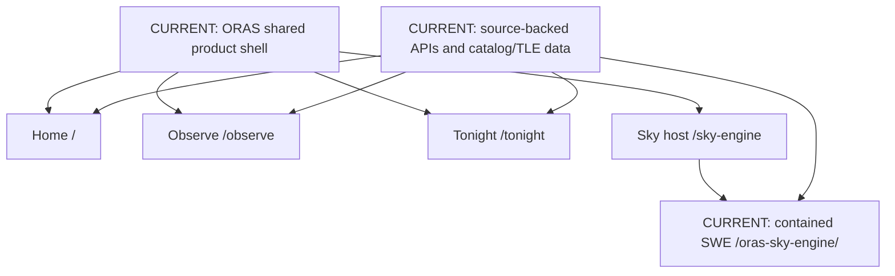
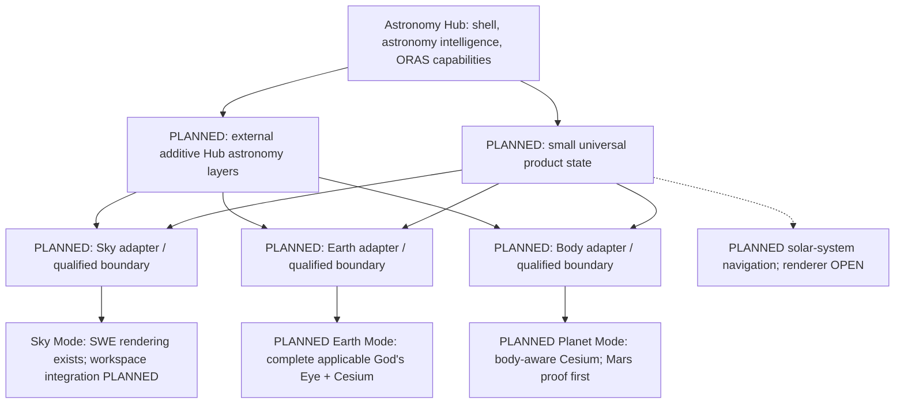

# Astronomy Hub — Architecture Diagram

Detailed authority: [Unified Universe Architecture](architecture/UNIFIED_UNIVERSE_ARCHITECTURE.md).
This document separates current implementation from approved future architecture.
It is not a mockup or proof that planned runtimes exist.

## Current implementation — PR #52 foundation



Home, Observe and Tonight are decision pages without a renderer. Sky mounts SWE;
SWE is also reachable standalone. The Hub owns shell/navigation and defined input;
SWE owns rendering, internal selection/camera behavior, lifecycle and visual math.
Existing scientific/identity contracts and satellite source paths remain valid.
Historical console-clean qualification is PARTIAL; see
[project state](execution/PROJECT_STATE.md). No fresh runtime proof in this task.

## Approved future architecture — not implemented



The adapters translate product intent; they do not become a common rendering
core. Applicable extensions integrate through qualified domain boundaries;
Earth-only layers do not migrate to other bodies. Renderer internals own scenes,
math, camera execution and selection realization. The Hub owns mode, time,
observer, selected entity/body, camera intent, applicable layers and history.
The [Phase B study](studies/GODS_EYE_SWE_COMPATIBILITY_STUDY.md) selects externally
pinned sources, independent full-app builds, same-origin frames and a versioned
capability bridge; exact APIs and runtime qualification remain open.

God's Eye preserves complete applicable upstream Earth capability, including
non-astronomy layers, subject to provider terms. Hub astronomy layers are external
additions. Both SWE and God's Eye source is immutable by default, with pinned,
qualified revisions and explicit exceptions for unavoidable tiny patches.
Data/provider/visual-asset terms are separate from code licensing.

## Planned navigation

```text
ISS in Sky → Show on Earth → same ISS and relevant time/orbit context
ISS on Earth → View from ORAS → same identity/time, ORAS observer, ISS centered

Mars in Sky → Explore Mars → body-aware Cesium Mars globe → approach surface
Mars surface → Leave Mars → planetary context → View Mars from ORAS → SWE

Later scale aspiration:
ORAS local sky → Earth → Earth–Moon → solar system → body → planetary surface
```

Controlled renderer handoffs preserve visual and contextual continuity; perfect
continuous-camera transforms are not promised. Solar-system-scale renderer
and transition animation remain open. Active-only heavy renderer lifetime is
the Phase B recommendation. Observe/Tonight
stay independent routes and later gain contextual workspace drawers. Home/Sky
may converge conceptually; no current route changes.

## Structural and execution models

```text
Scope → Engine → Filter → Scene → Object → Detail → Assets
Ingestion → Normalization → Storage → Cache → API → Client Rendering

A docs → B compatibility study → C runtime skeleton → D ISS → E Mars → F extensions
```

Phase B is the active study. Next recommended task is its bounded Phase C
Sky/Earth skeleton (study section 29). `oras_horizon.v1` remains approved in later astronomy extensions, not next.
No integration, renderer, transition, horizon, satellite/flight or UI implementation
is authorized inside this documentation checkpoint.
