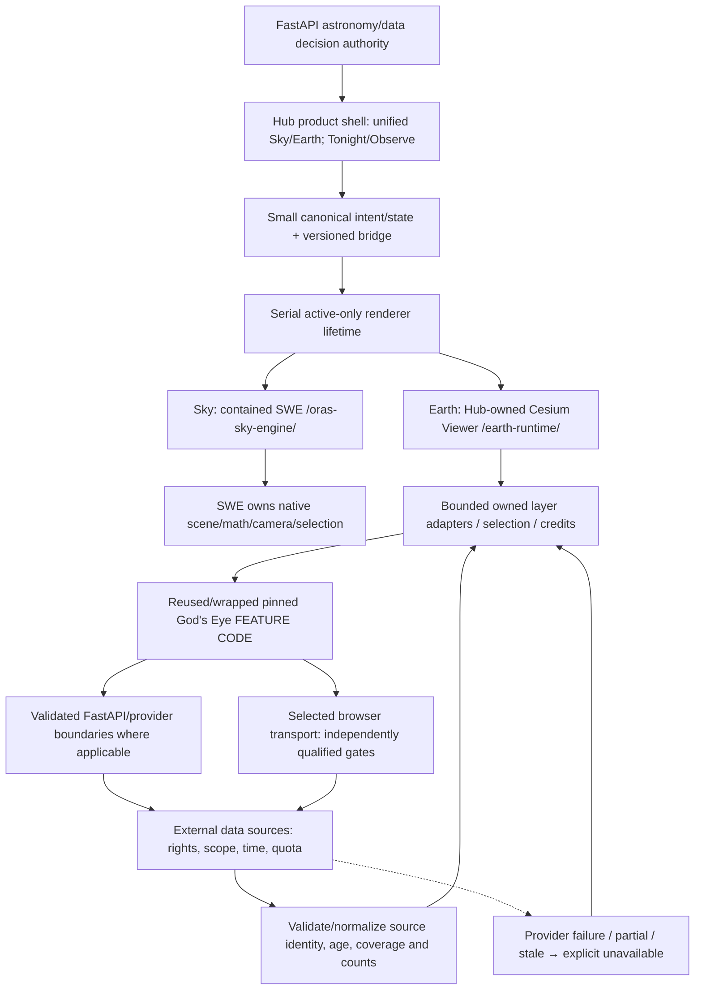

# Astronomy Hub architecture diagram — current and planned

[Architecture](architecture/UNIFIED_UNIVERSE_ARCHITECTURE.md),
[ADR0009](architecture/decisions/0009-owned-earth-feature-reuse.md),
[current evidence](audits/GODS_EYE_CAPABILITY_IMPLEMENTATION_RECONCILIATION_2026-10-05.md) and
[execution gates](execution/PROJECT_STATE.md). Documentation only; diagrams do
not prove every source currently succeeds. Current small state is not all future
cross-body navigation. No full upstream app is embedded.

## Implemented boundaries

Owned Viewer does not justify unnecessary feature recreation. Provider status,
source time and actual rendered counts are separate; no fabricated visibility or
success timestamp on failure. Current aircraft is observer-bounded, satellites
stations-only, Weather one modeled point plus separate CONUS radar. C5.5 imagery
is historical CONUS HD/coarse global; terrain ellipsoid, skybox disabled. These
limits do not erase the implemented shell/bridge/Viewer foundation.

## Proposed expansions — no current runtime claim

```mermaid
flowchart LR
    Review["C5.6.75 owner review"] --> Approval["Explicit approval + unresolved decisions"]
    Approval --> Recovery["PROPOSED C5.7 A aircraft → B satellites → C weather → D stars → E integrated QA"]
    Recovery --> C6["C6 DIRECTION: qualify providers → global imagery → terrain/heights → 3D → display/QA"]
    C6 -.-> D["D planned: ISS identity/time/frame handoff"]
    D -.-> E["E planned: Mars/body-specific surfaces"]
    E -.-> F["F planned: source-backed astronomy extensions"]
    F -.-> G["G planned: immersive/scene/share UX"]
    G -.-> H["H planned: solar-system scale; renderer OPEN"]
```

No uniform global aerial detail, freely reusable Google Earth, scientifically
time-aware starbox, second Stellarium behind Earth or physical AR proof implied.
Earth-only data cannot become Mars data. Approved direction/proposed default is
not execution authorization. MASTER_PLAN is product reference; PROJECT_STATE
controls sequence. Structural models remain Scope→Engine→Filter→Scene→Object→Detail→Assets
and Ingestion→Normalization→Storage→Cache→API→Client Rendering.
