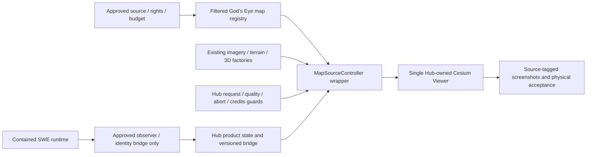

# Earth Visual Foundation Decision Packet — 2026-10-10

**SUPPORT — proposed design/acceptance for owner review; no implementation or provider authorization.**

The smallest useful correction is to restore the existing Cesium star background on the Hub-owned Viewer, qualify explicit atmosphere settings, then reuse God’s Eye’s map switching and provider factories for progressively better imagery, real terrain and supported-region 3D. This keeps the current architecture and avoids another Earth renderer. Google-Earth-class exploration is a quality goal for supported data, not a worldwide coverage promise.

## Mandatory $0 provider policy

**Maximum authorized new provider spending: $0.** No paid subscriptions, usage charges, automatic upgrades or billing-enabled trials. Use open-source code and authorized public/free data first; retain an independently functioning free fallback. Free accounts require permitted club/audience use, respected quotas and no monetary liability. A working unauthenticated endpoint proves no unlimited public rights. The [canonical policy and Community qualification](EXTERNAL_COMPONENTS_AND_DATA_GAPS_2026-10-10.md#mandatory-owner-provider-budget) govern this packet and all adoption recommendations.

Cesium ion Community: **CONDITIONAL ZERO-COST CANDIDATE — NOT YET AUTHORIZED FOR CLUB OPERATION**. The $0 requirement is settled; provider/audience eligibility is unresolved. Paid comparisons remain research only, **NOT ADMISSIBLE UNDER CURRENT OWNER BUDGET**.

## What exists and what remains unproved

| Item | Current source/runtime reality | Proposed correction or qualification |
|---|---|---|
| Viewer | [ViewerController](../../runtimes/earth-runtime/core/ViewerController.mjs) owns one Cesium Viewer; requestRenderMode enabled, active-only runtime | Keep ownership and current lifecycle/bridge; never call upstream createApplicationViewer |
| Stars | Current source explicitly sets `viewer.scene.skyBox.show=false`; Cesium 1.138.0 default skybox exists | Enable the existing skyBox; if absent, use native SkyBox.createEarthSkyBox with bundled six Tycho faces; no new star renderer/data download |
| Atmosphere/day/night | Hub already enables ground atmosphere, lighting and Sun-driven dynamic atmosphere; dark background and fog already configured | Tune explicit sky-atmosphere parameters against paired screenshots; validate light direction/terminator/time; do not report existing lighting as absent |
| Imagery | [ImageryController](../../runtimes/earth-runtime/core/ImageryController.mjs) has local NaturalEarth fallback, coarse NASA GIBS and regional historical USGS; bounded requests | Keep those providers/admission; add selected global source and upstream switching rather than another controller |
| Terrain/3D | [VisualFoundation](../../runtimes/earth-runtime/core/VisualFoundation.mjs) has gated config/loader and ellipsoid fallback | Scaffolding is not qualified real terrain/photoreal. Select data/rights and execute existing factories under status/lifetime/budget guards |
| Aircraft | PR #67 holds recovery outside merged main | Preserve unchanged and unmerged; no further presentation investment before proposed visual acceptance |
| Sky science | Contained `/oras-sky-engine/` and validated backend contracts | Decorative Earth starbox/lighting do not become a scientific sky, observer horizon or catalog |

These are fresh source findings, inherited committed qualification boundaries, and future expectations. No browser/provider/device run was performed for this docs-only packet; no new visual quality is claimed. Owner screenshots from an earlier preview and upstream marketing images are not this packet’s acceptance evidence.

## Exact visual reuse path

All pinned paths below refer to `e7707d9a0f34d9fbffc300023c319f95caa5be30`; symbols, line anchors, hashes/imports and legal gates are in the [reuse register](gods-eye-adoption-register-2026-10-10.json) and [blueprint details](GODS_EYE_MASTER_ADOPTION_BLUEPRINT_2026-10-10.md#reuse-details).

### Stars, planet appearance and mobile compatibility

1. In the future approved small package, retain the existing Viewer and enable its standard skybox. Installed Cesium `SkyBox.createEarthSkyBox()` uses six `Assets/Textures/SkyBox/tycho2t3_80_{px,mx,py,my,pz,mz}.jpg` faces. Retain SDK notices and existing artifact admission; compare frame/input/artifact hashes and request paths, rather than replacing assets. A visible background is not a Gaia/Hipparcos lookup surface. [Native API](https://cesium.com/learn/cesiumjs/ref-doc/SkyBox.html).
2. Upstream `src/app/viewer.js:createApplicationViewer` configures SkyAtmosphere intensity 18, saturation −0.12 and brightness −0.08. Use those as **candidate settings** on the existing scene, not an accepted aesthetic or a reason to import that Viewer factory. Preserve Hub Sun/ground-atmosphere lighting, background, DPR/resolution scale and request-render policy; assess terminator, halo and stars under day/night times. Shadow/HDR/bloom/imagery brightness changes need separate physical budget and natural-color comparison. [Atmosphere API](https://cesium.com/learn/cesiumjs/ref-doc/SkyAtmosphere.html).
3. `src/app/atmosphereCompat.js:applyModelAtmosphereWorkaround` probes the out-param varying link failure and Apple mobile platform, conditionally setting **fog.renderable=false**. It does not require disabling all SkyAtmosphere/ground atmosphere. No public package export exists: investigate a generic export first; if unavailable, an explicitly approved tiny provenance-preserving port. Apply before first model/tileset; destroy/lose the auxiliary probe context. Physical Safari/iOS/iPad tests must prove the workaround, atmosphere appearance and absence of persistent extra WebGL contexts.
4. Optional `installTrackpadPinchZoom` is publicly exported with the Viewer factory but can be called on the current Viewer alone. It bounds Ctrl-wheel deltas and restores listeners/zoom configuration on cleanup. It is not required for stars; qualify trackpad, keyboard/touch and lifecycle independently.

### Global maps: wrap existing orchestration

`MapSourceController` (`./maps/controller`) accepts the owned Viewer, registry, initial stack and onChange/onError/requestRender hooks. Its source generation/availability logic guards delayed construction, manages its own imagery/tilesets, catches provider errors and falls back. `createDefaultMapSources` (`./maps/defaults`) plus `MAP_STACKS`/registry supplies construction policy. The public imagery factories already construct OSM, Esri and ion providers. Do not reimplement these algorithms.

The Hub wrapper must filter the catalog to **explicitly selected entitled products**, adapt current local/GIBS/USGS admitted providers, and retain global request/cancel/bytes guards. A nonempty token is not an entitlement check. Default upstream Esri/Google/Bing preference is not the approved product policy. Bing is excluded for the reasons in the [external matrix](EXTERNAL_COMPONENTS_AND_DATA_GAPS_2026-10-10.md#dated-cost-and-rights-facts).

The controller removes/replaces its **own** base imagery, rather than every imagery layer. Keep C5 weather/radar overlays and selection identities alive during switches. Globe mode re-enables the globe and selected terrain; photoreal mode hides the globe and activates a tileset. Factory-created tilesets are controller-owned; externally provided tilesets have a different lifetime contract and need Hub disposal. Prove late arrivals cannot replace a newer manual choice, fallback is truthful, and externally owned data are never removed accidentally.

`createMapCredits` is internal but already used transitively by the public controller. It follows the visible/fallback source; it currently reaches `scene.frameState.creditDisplay`. Installed Cesium also exposes `viewer.creditDisplay`; prefer a generic public credit-display seam if coupling becomes a compatibility problem. Preserve tile-level credits plus accessible Hub attribution; source HTML must come from admitted trusted provider metadata, never arbitrary user markup. Do not silently port the controller just for UI convenience.

### Terrain, height services and grounding

Use `createWorldTerrain` for entitled ion World Terrain, or `createKeylessTerrain` for Re:Earth quantized mesh. Vertex normals/terrain data and ground-atmosphere lighting improve relief; terrain is not photographic building geometry. Reuse `createKeylessTerrainResource` and its transitive retry policy, rather than a second retry loop. Three attempts, selected transient statuses, Retry-After and jitter still need a global request/concurrency budget and abort behavior.

Keyless factory failure may return `EllipsoidTerrainProvider`. The wrapper must record **ellipsoid fallback / real terrain unavailable**, not report terrain loaded merely because a provider object returned. Terrain/imagery/3D source and mode should be visible in status. Re:Earth rights/availability and ion public-use entitlement are external decisions; neither was live-qualified here.

`createTerrainHeights({source,signal,…})` has an injectable source and bounded batching/cache/cooldown, but no package export. `createGroundFloor` and `createMeshFloorSampler` likewise exist as service modules. Prefer generic exports; otherwise request the tiny-port exception before reuse. Do not import their `src/data/*` application-service singleton facades. The public `./sources/terrain` request normalization/validation helpers and existing FastAPI DTO/cache boundary can support the client; `server/providers/terrain.js` is a source algorithm reference, not approval for a new general Node backend.

Datum rules must survive reuse: ellipsoidal `h`, orthometric `H` and geoid `N` relate by `h=H+N`; a geoid-only fallback assumes ground `H=0` and is **not measured ground**. Admit the lazy `egm96-universal` code/grid provenance separately and keep its data chunk out of eager rendering. Unknown/missing heights remain unavailable with quality/source/time fields. Compare reference points with owner-approved tolerances before camera/models use samples.

In photoreal mode, visible mesh floor can differ from bare-earth DEM. Existing mesh sampler budgets near-camera samples, excludes entities and validates against a prior. Returned roofs/objects are not automatically ground. Google analysis/content terms must permit any proposed sampling use; rendering permission alone is insufficient. Terrain-aware camera behavior must prevent below-surface motion while preserving current cancellation/observer/science semantics. Do not alter observer elevation from cosmetic grounding.

### Photorealistic 3D and buildings

`loadPhotorealisticTileset`, `createGoogleDirectTileset`, `createGoogleIonTileset`, `selectMapStartupRoute` (`./maps/3d`) already supply direct → ion → controlled failure routing. They accept Cesium/keys/tokens and do not require the full app. The loader’s `osm` failure route is a label, not construction of the Hub fallback; the wrapper must actually select an approved globe map. Ion Google asset is 2275207. Native `createOsmBuildingsAsync` uses asset 96188 in the installed SDK; there is no equivalent dedicated pinned God’s Eye building factory.

The pinned direct helper asserts `onlyUsingWithGoogleGeocoder:true`; only pass that factual contract when the selected product uses Google-compatible geocoding. Disable incompatible search/fallback combinations and follow provider attribution/usage rules. Direct and ion access are alternative source routes. Direct billing and paid ion routes are **NOT ADMISSIBLE UNDER CURRENT OWNER BUDGET**; only eligible Community 3D could proceed after written club/public rights and $0 confirmation. Retain existing factories without activating either route. Missing 3D coverage requires source-tagged manual/controlled fallback, never invented buildings or seamless-quality claims.

Pinned ion factory configures **1,536 MiB cache plus 1,024 MiB overflow**; do not copy this budget blindly to mobile. Installed `Cesium3DTileset.cacheBytes` and `maximumCacheOverflowBytes` have setters, so the wrapper can set approved device targets after factory resolution **before adding the primitive**, keeping upstream factory unchanged. Proposed starting targets: desktop 512/256 MiB, mobile 256/128 MiB, to be validated rather than promised. Cache values trim unused tiles; they are not hard caps on total GPU/process memory. Instrument tileset memory/requests, context count and physical frame/input performance; reduce detail or exit 3D under the approved resource policy.

Latest `src/maps/googleTokens.js:createGoogleTokenSource` adds expiring server-token acquisition, renewal and bounded auth retry; it is not in the approved pin. Token backend, credentials, public export seam and source upgrade/exception require separate approval. Do not build it during this audit or assume a server route exists. Generation guards must destroy late tilesets, release controller listeners/resources and preserve active-only Earth/Sky lifetime.

## Three provider tiers

| Tier | Proposed composition / existing code | Expected improvement and coverage | Terms and quality ceiling | Operating cost / uncertainty |
|---|---|---|---|---|
| 1 — Keyless / no recurring provider charge | Standard Cesium stars/atmosphere; current local/NASA/USGS; controlled OSM; qualified Re:Earth; existing map/terrain factories | Convincing space/continental relief, roads/labels and US regional imagery where available | Coarse worldwide imagery, variable terrain/road coverage; no worldwide photographic city buildings or guaranteed service SLA | No new provider subscription for these selected public endpoints; hosting, egress and service limits remain. Do not promise unlimited public tile traffic |
| 2 — Conditional zero-cost account service | Only eligible free MapTiler/Esri products or conditional ion Community imagery, World Terrain, OSM buildings/Google 3D; existing constructors/controller | Better progressive global detail and relief; structural buildings where data exist | Account/product/public deployment and free-use eligibility must match Hub. Free allocation is not universal organizational permission; no continuous worldwide photoreal guarantee | Published Community allocations and unresolved rights/$0 liability in external matrix; independent free fallback and aggregate request limits required |
| 3 — Paid / premium photoreal research only | Selected Google direct or ion 3D route + permitted fallback, existing 3D loader/controller, device LOD/budget wrapper | Supported-region photographic city/close exploration closest to the quality goal | Coverage/date/mesh quality vary; strict logos/data/export/analysis/geocoder terms; actual Oil City and every test city coverage unverified | **NOT ADMISSIBLE UNDER CURRENT OWNER BUDGET**. Retain direct SKU/paid ion research; no executable recommendation |

The [external matrix](EXTERNAL_COMPONENTS_AND_DATA_GAPS_2026-10-10.md) is the canonical current pricing/terms source, avoiding contradictory duplicated estimates. Select one primary aerial source plus compatible fallback, one terrain source and one 3D access route. Provider/account approval requires $0 protection and separate owner authorization; paid execution is not authorized. No tier was activated or demonstrated here.

## Visual acceptance proposal

**Future acceptance**, not achieved evidence. Before implementation, owner approves these targets and permitted provider/device test budget. For every screenshot record commit, pin, artifact hash, device/GPU/browser, selected and actual fallback source, camera lon/lat/height/heading/pitch, UTC scene time, source acquisition/valid time if available, terrain datum/mode, load state, credits and measured performance. A provider’s documented capability is category D; selected-account available data is A; working approved-head Hub capture is R; untested expectation is U. All new visual targets below are currently **U**; citations/factory inspection only establish D. A and R remain to be acquired.

| Camera level / suggested height above ellipsoid | Minimum visible detail / source | Terrain / atmosphere / buildings / labels | Coverage, credits and failure/load requirement | Required screenshot and performance proof |
|---|---|---|---|---|
| Full Earth, 15–25 million m | Recognizable continents/ocean, coherent day/night, visible standard stars, atmospheric limb; local/NASA or selected primary overview | Correct Sun time/direction; terrain can simplify; no city-label clutter or decorative fake clouds | Whole-globe baseline available even when high-detail source fails; display actual source and attribution | Paired day/terminator/night with visible credits; no black/flat planet or persistent loader; shell ≤5 s, baseline ≤10 s under stated network |
| Continental, 1–5 million m | Coastlines/mountain belts; primary imagery progressively resolves beyond coarse NASA | Real terrain source selected or honest ellipsoid; atmospheric perspective; sparse licensed labels | Show source dates/resolution where supplied; no promised fixed worldwide resolution | Coast/ocean/high-latitude and source-off test; no tile seams/stuck low LOD; within global frame/load budget |
| Regional, 50–500 km | Identifiable regional landforms and roads/cities where provider supports; ORAS/USGS historical regional detail | Terrain ridges/valleys and correct mode; labels optional and readable | Variable imagery age/coverage visible; USGS CONUS extent never presented worldwide | Same camera before/after and fallback; terrain-on/off silhouette; height-reference and attribution evidence |
| City, 2–20 km | Recognizable city blocks/major roads for selected coverage; licensed aerial/raster labels | Non-flat relief where present; OSM buildings or 3D only where entitled; atmosphere not opaque | City HD availability must be measured, not inferred from overview; no fabricated building fill | Nadir + oblique per target, selected primary/fallback pair, labels on/off, detail settled ≤20 s under stated network |
| Neighborhood, 100–1,000 m | Streets/building footprints or photographic structures where available | Ground/mesh mode correct, collision/grounding, readable labels and unobscured credit | Tier 1 may fail desired aerial detail honestly; record source ceiling, not a passing city-quality substitute | Matching oblique close view, no hovering/buried models, actual terrain/mesh/source status and memory/request telemetry |
| Close/3D, 10–100 m AGL where safely supported | Real mesh/buildings with visible geometry/material detail, no synthetic fidelity claim | Ground-relative camera only after datum/surface proof; avoid underground view; stars/halo need not be visible at ground | Photoreal/data gaps trigger controlled permitted fallback; credits remain legible; no “uniform worldwide 3D” claim | Ground/roof/oblique and unsupported-area captures, auth/coverage failure, zoom/repeated switch stress and physical desktop/mobile tests |

Camera ranges are repeatable test proposals, not measured distances at which every source resolves. AGL requires qualified terrain/mesh; ellipsoidal camera height must not be mislabeled above-ground height. Tier-specific failures must be accepted as limitations or lead to a different provider, not hidden by styling.

### Target grid and evidence set

| Target | Test center (degrees; approximate city navigation fixtures) | Coverage/quality concern to resolve |
|---|---|---|
| ORAS / Oil City region | ORAS canonical committed site `41.321903, -79.585394`; regional town/river views separately | Current regional historical imagery; real terrain/photoreal eligibility, site datum and surrounding streets must be tested |
| San Francisco | `37.7749, -122.4194` | Coastal imagery/mesh boundaries, hills, downtown height and terrain-vs-mesh grounding |
| Zürich / alpine region | `47.3769, 8.5417`; include a separately recorded mountain camera | Relief, dense city labels, shadows/lighting and missing-height accuracy |
| Nairobi | `-1.2921, 36.8219` | African imagery age/detail and 3D coverage; no assumption from North American quality |
| Tokyo | `35.6762, 139.6503` | Dense labels/geometry, mobile budget, imagery/mesh access and licensing |
| São Paulo | `-23.5505, -46.6333` | Southern hemisphere lighting/time, dense structures and provider coverage |

Run the six camera levels at **all six targets** (36 primary views per selected tier/source set), with shared identical full-Earth cameras labeled by target/time context. Add paired day/night/terminator, coastal/high-latitude/ocean, off-coverage, offline/429/401/expired-token, delayed-source switch and imagery/terrain/3D mode cases. Fixtures identify navigation targets, not scientific coordinates/availability claims. ORAS coordinates come from [EarthRuntime](../../runtimes/earth-runtime/core/EarthRuntime.mjs) and the canonical Hub site; do not change them to make terrain look correct.

Store captures as `tier-source-target-level-time-state.png` with a machine-readable metadata manifest and comparison sheet. Use actual Hub output; owner judges “recognizable / convincing / readable” alongside numeric checks. Marketing photos never satisfy R. Preserve failed/off-coverage captures and fallback status, and human review remains blank until performed.

### Proposed physical budgets and regression gates

- Baseline test networks: desktop 100 Mbps / 50 ms RTT and mobile 10 Mbps / 100 ms RTT, recorded and throttled consistently; cache-cold and cache-warm separate. Suggested shell/overview/detail times above need owner agreement. On failure, keep the globe usable and show controlled status within 10 s; no indefinite spinner.
- Physical desktop target ≥30 FPS and mobile ≥24 FPS during a repeatable 30-second navigation trace; p95 input-to-visible response ≤200 ms. Static idle should approach ≤1 rendered frame/sec while preserving required time-driven content. Record frame distributions, source requests and late work, not only average FPS.
- One heavy active renderer, zero retained Earth scene/listener/tileset resources after disposal, no increasing live resource trend across ≥5 genuine Earth/Sky switches and bfcache cycles. Software rendering is supporting evidence, not mobile/desktop GPU qualification.
- 3D memory targets above are initial cache policies; measure tileset memory and physical device behavior, lower LOD or disable 3D if budget fails. Do not promise a hard total-GPU cap from a cache parameter.
- Regress PR #67 preserved contracts, current event/weather overlays, science object identity/string IDs, observer/time, selection/tracking, permission-negative provider requests, credits, inaccessible credentials, cancellations, source data freshness and renderer isolation.

No paid/entitled provider tests may run merely because this acceptance proposal exists. Source compatibility, account data availability, actual Hub captures and owner acceptance must be recorded independently.

### Unsent Cesium inquiry

**DRAFT ONLY — NOT SENT.** Audience accessibility remains an owner clarification before provider activation; the inquiry deliberately covers members-only and potentially public use.

> Astronomy Hub is being donated to a nonprofit amateur astronomy club with fewer than 100 members and provides free public astronomy education. We require $0 recurring provider charges and cannot accept paid plans, overage invoices, automatic charges/upgrades or billing-enabled trials. Please confirm in writing whether ion Community permits a club-operated individual account and this donated application, both for member access and potentially for a publicly accessible website whose visitors need not be members. Does this qualify as unfunded educational activity, and is a separate integration agreement required? What organizational/funding information do you need? Which included imagery, World Terrain, OSM Buildings and Google 3D assets may we use, subject to what content/attribution restrictions? When any quota is exceeded, can usage create any monetary obligation, automatic charge or mandatory paid upgrade, including under terms §4.1? Can the account remain strictly $0 with enhanced access disabled and an independent free fallback instead of upgrading? Please identify the applicable terms and confirm any binding no-overage arrangement needed for this project.

No message, account registration, token creation, billing setup or provider activation is authorized by this draft.

## Owner decisions

| Proposal decision | Recommendation | Required before execution |
|---|---|---|
| MD-01 Priority/phase order | Visual foundation → mapping → terrain → 3D → visual acceptance → Earth objects/intelligence | Approve precise C5.7-D / C6 reorder; preserve existing unresolved C5.7 decisions and PR #67 |
| MD-02 Provider/tier/public scope | Qualify keyless ceiling first; choose one licensed global imagery primary and optional 3D route if owner wants supported-city quality | Clarify member/public audience; obtain written club rights/$0 protection, source licenses, independent free fallback and geography |
| MD-03 Account/spend/usage | **Owner requirement settled: $0 new provider spending**; no paid plans/usage, upgrades or billing-enabled trials | Before activation: owner approves eligible free provider configuration; written ion club/public rights and no-charge quota behavior; enforce aggregate usage caps |
| MD-04 Terrain/3D quality scope | Real source/datum and known references; photographic targets only where available | Height tolerances, terrain vs mesh mode, minimum global/detail coverage and acceptable fallback ceiling |
| MD-05 Reuse seams | Public factories/wrappers first; four internal service/compatibility exports or narrow ports only if unavoidable | Generic-hook investigation and explicit small patch exception; no accepted ADR reversal |
| MD-06 Visual/performance acceptance | Adopt target grid and proposed physical budgets, with owner image review | Owner approves thresholds/devices/source test budget and final captures before any visual-readiness claim |

The owner has resolved the spending requirement at $0; no provider, implementation or phase-order approval is granted by this packet. Recommended first development task, **only after explicit approval**, is the bounded C5.7-D owned-Viewer starfield/appearance correction with no provider changes; mapping follows C6-0 rights selection and separately approved stages. The [roadmap proposal](GODS_EYE_ROADMAP_REPRIORITIZATION_PROPOSAL_2026-10-10.md) records exact ordering impacts without rewriting execution authority.
